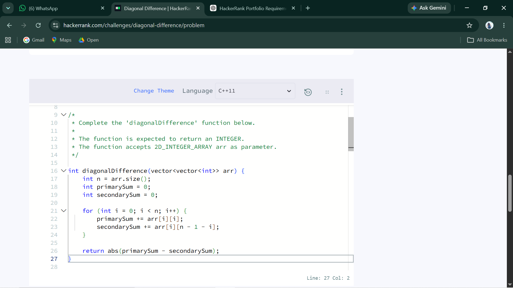
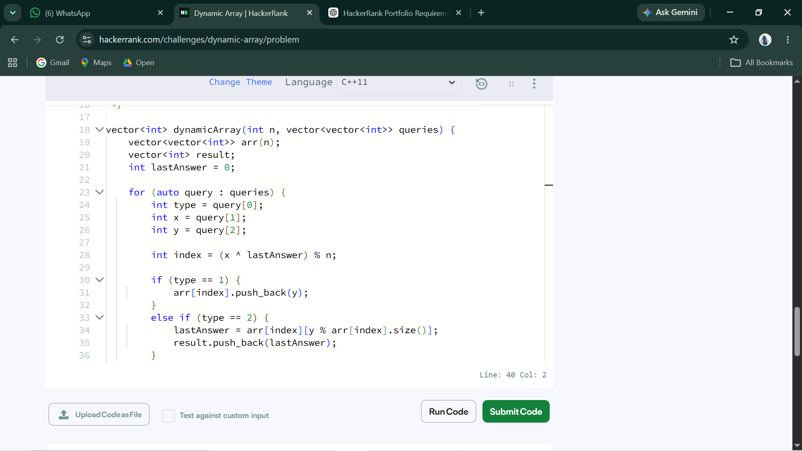
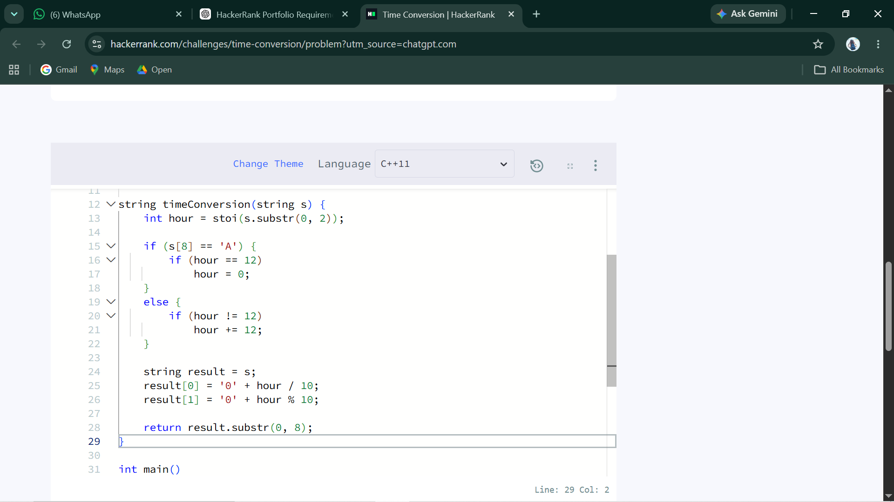
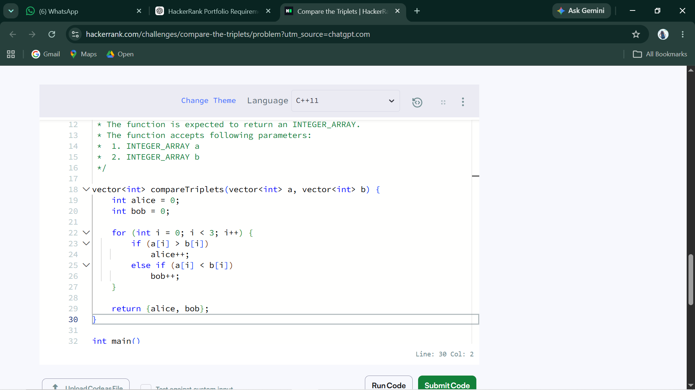
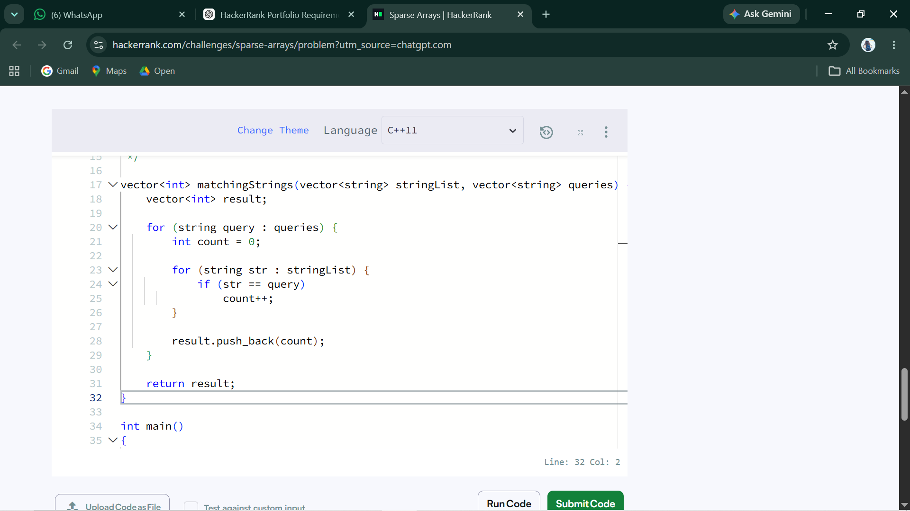

# HackerRank 3rd Semester Portfolio

## About This Repository

This repository contains my solutions to the five mandatory HackerRank problems completed as part of my 3rd Semester CSE studio activity.

The activity focuses on strengthening problem-solving skills, data structure concepts, algorithmic thinking, and understanding time and space complexity.

**Programming Language:** C++11

## HackerRank Profile

**Username:** [@kavyarai812](https://www.hackerrank.com/kavyarai812)

## Problems Solved

| No. | Problem              | Topic                    | Time Complexity | Space Complexity |
| --- | -------------------- | ------------------------ | --------------- | ---------------- |
| 1   | Diagonal Difference  | 2D Arrays / Matrices     | O(N)            | O(1)             |
| 2   | Dynamic Array        | Dynamic Arrays / Vectors | O(N + Q)        | O(N)             |
| 3   | Time Conversion      | Strings & Logic          | O(1)            | O(1)             |
| 4   | Compare the Triplets | Basic Implementation     | O(1)            | O(1)             |
| 5   | Sparse Arrays        | Hash Maps / Strings      | O(N + Q)        | O(N)             |

## Repository Structure

```text
HackerRank-3rdSem-Portfolio/
│
├── Diagonal-Difference/
│   └── solution.cpp
│
├── Dynamic-Array/
│   └── solution.cpp
│
├── Time-Conversion/
│   └── solution.cpp
│
├── Compare-the-Triplets/
│   └── solution.cpp
│
├── Sparse-Arrays/
│   └── solution.cpp
│
└── README.md
```

## Key Learning Outcomes

* Practiced solving programming problems using C++.
* Improved understanding of arrays, vectors, strings, and hash maps.
* Learned to analyze time and space complexity.
* Practiced writing efficient solutions instead of relying on unnecessary nested loops.
* Used Git and GitHub to maintain and document programming solutions.
* Gained experience solving problems on an industry-recognized coding platform.

## HackerRank Submission Evidence

### Diagonal Difference


### Dynamic Array


### Time Conversion


### Compare the Triplets


### Sparse Arrays


### HackerRank Profile and Badge


## Conclusion

This activity helped me strengthen my fundamental problem-solving skills and understand how algorithm efficiency affects the performance of a program. Solving the problems on HackerRank and documenting the solutions on GitHub also gave me practical experience in maintaining a structured programming portfolio.
